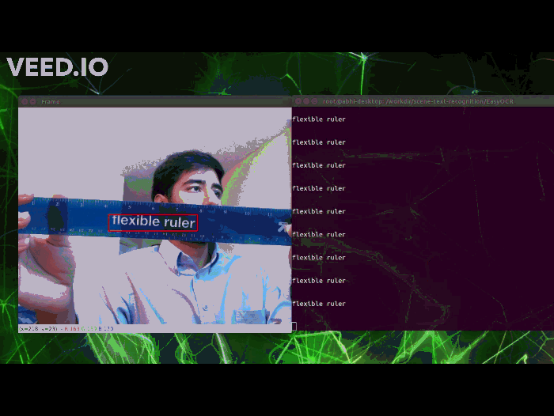
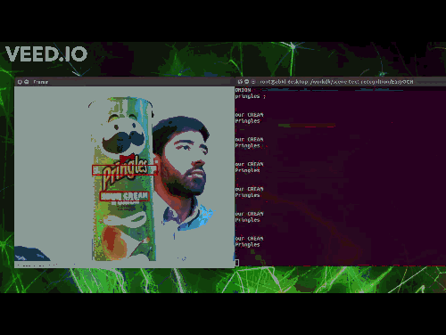

# scene-text-recogntion
 
> Real-time scene text recognition accelerated with NVIDIA TensorRT

Note: the following demos show a poor resolution due to conversion to gif. The real-time video application run with video_capture.py can display at your usb camera's full resolution and nearly the same fps as your camera's spec.


 
## Quickstart

1. Clone Repo
```bash
git clone --recursive git@github.com:tomek-l/nv-scene-text-recognition.git
```

2. Install pytorch, torchvision
```bash
wget https://raw.githubusercontent.com/tomek-l/jetson-install-pytorch/master/install_torch_v1.9.sh 
bash install_torch_v1.9.sh
pip3 install -r requirements.txt
```
 
3. Install torch2trt

Until this [PR](https://github.com/NVIDIA-AI-IOT/torch2trt/pull/627) is merged use Chitoku's [branch](https://github.com/chitoku/torch2trt/tree/jp4.6_tensorrt8) containing a fix for TensorRT 8.
```bash
cd torch2trt 
sudo python3 setup.py install --plugins
```

4. Install easyOCR
```bash
cd EasyOCR
sudo python3 setup.py install
```

#### Dockerfile 
1. Make sure docker is setup correctly on the jetson as directed [here](https://gitlab-master.nvidia.com/dustinf/jetson-voice#docker-daemon-configuration). Nvidia should be the default docker runtime daemon.

2. Build the dockerfile
    ```
    docker build -t scene-text-recognition .
    ```
3. Run the dockerfile
    ```
    sudo docker run -it --rm -v ~/workdir:/workdir/ --runtime nvidia --network host scene-text-recognition
    ```
    where workdir is the directory contianing this cloned repo, or is the clone repo.
    
    If you are using a realtime camera:
    ```
    xhost +
    sudo docker run -it --rm -v ~/workdir:/workdir/ --runtime nvidia --network host -e DISPLAY=$DISPLAY --device /dev/video0: dev/video0 scene-text-recognition
    ```
    Where video0 is correct device id into the container. This can be found using:
    ```
    ls /dev/video*
    ```

### Step 3 - Run the example files

There are three separate demo files included: 

#### 1. easy_ocr_demo.py
This program uses EasyOCR to read an image or directory of images and output labeled images. The output is in the labeled-images/ directory

To use easy_ocr_demo:
```
python3 easy_ocr_demo.py images
```
where images is an image file or directory of images.

#### 2. easy_ocr_benchmark.py
Using the pretrained EasyOCR detection and recognition models, we benchmark the throughput and latency and show the speedup after it is converted to a TensorRT engine (TRT) on the Jetson AGX Xavier.
 

| Model | Throughput (fps) | Latency (ms) |
|-------|-------------|---------------|
| Detection | 12.386  | 84.190 |
| Detection TRT | 24.737 | 48.990 |
| Recognition | 174.518 | 5.900 |
| Recognition TRT | 7118.642 | 0.160 |

To run this benchmark:
```
python3 easy_ocr_benchmark.py
```

This program will store the Torch2trt state dictionaries in the torch2trt_models dictionary. 

#### 3. video_capture.py
This program uses an attached USB camera to display a realtime video. The code will display bounding boxes around the text in the video and output the text in the terminal. Click on the video screen and type 'q' to terminate the program. 
After plugging in the USB camera, but before running the python file, check the device id, and make sure that is passed into 'cap = cv2.VideoCapture(0)' line. By defualt we assume it is zero, change the argument in cv2.Videcapture() to the correct device id before running the program. The deviced id can be checked by doing:
```
ls /dev/video*
```
To run the program:
```
python3 video_capture.py
```
 
### Step 4 - Write your own code
The easyocr package can be called and used mostly as described in the EasyOCR repo. This repo, however, also adds the use_trt flag to the reader class. Setting use_trt = True, will convert the models to tensorRT or use the converted and locally stored models, when performing detection.

Example code:
```
import easyocr
reader = easyocr.Reader(['en'], use_trt=True)
result = reader.readtext('path/to/image.png')
print("TensorRT Optimized Result",result, '\n')
```
## More:

### Different Models
The code is designed to be able to swap in and out various detection models. As an example, view detect.py file to see where the EAST detection model was substituted in.

### Custom Training
To train and run your own models please see the EasyOCR [instructions](https://github.com/akamboj2/EasyOCR/blob/master/custom_model.md)


## See also
 
- [trt_pose_hand](http://github.com/NVIDIA-AI-IOT/trt_pose_hand) - Real-time hand pose estimation based on trt_pose
- [torch2trt](http://github.com/NVIDIA-AI-IOT/torch2trt) - An easy to use PyTorch to TensorRT converter
 
- [JetBot](http://github.com/NVIDIA-AI-IOT/jetbot) - An educational AI robot based on NVIDIA Jetson Nano
- [JetRacer](http://github.com/NVIDIA-AI-IOT/jetracer) - An educational AI racecar using NVIDIA Jetson Nano
- [JetCam](http://github.com/NVIDIA-AI-IOT/jetcam) - An easy to use Python camera interface for NVIDIA Jetson
 
## References
 
The scene text recogntion framework used here is a modified version of the EasyOCR open-source code [EasyOCR](https://github.com/JaidedAI/EasyOCR). 

Below are the sources of the default [detection](https://arxiv.org/abs/1904.01941) and [recogntion](https://arxiv.org/abs/1507.05717) models:

 
*  Baek, Y., Lee, B., Han, D., Yun, S., & Lee, H. (2019). Character region awareness for text detection. In Proceedings of the IEEE/CVF Conference on Computer Vision and Pattern Recognition (pp. 9365-9374).
 
*  Shi, B., Bai, X., & Yao, C. (2016). An end-to-end trainable neural network for image-based sequence recognition and its application to scene text recognition. IEEE transactions on pattern analysis and machine intelligence, 39(11), 2298-2304.


## Licenses
This code is licensed under The MIT License as described [here](https://gitlab-master.nvidia.com/akamboj/scene-text-recognition/-/blob/master/LICENSE).
The submodule EasyOCR is licesned under Apache License 2.0 as described [here](https://github.com/akamboj2/EasyOCR/blob/master/LICENSE).
